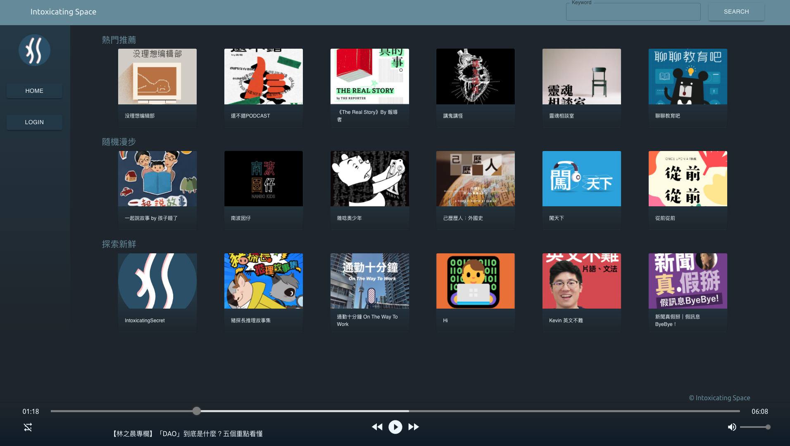

# Intoxicating Space (IS)

### Click here! [intoxicating.space](https://intoxicating.space)

IS is a lovely place for creators and podcast addict to enjoy or even publish their origin Podcast shows here!

- You may "Intoxicate" with sharing thoughts to people of the same taste in chatroom.

- You can edit your own "Space" information to present your personal style to followers at any time.

- IS also provides special RSS Feed helping you to "Podcast" all over the world!

## Contents

- [Welcome](#Welcome)
- [Features](#Features)
- [Website Structure and Technologies](#website-structure-and-technologies)
- [Database](#Database)
- [Running Test](#running-tests)
- [Author](#Author)

## Welcome

- Welcome to Intoxicating Space!



<p align="right"><a href='#contents'>| back to content |</a></p>

## Features

#### Podcast Player

- Choose your favorite podcast show first.
- Login default account or signup a new account to become a creator!


#### Interactive Time Stamp Chatroom

- Intro helper at the bottom left corner will let you know more allowed operations.
- Leave message and interact with someone in chatroom to share your feelings.
- Click time stamp along with message to fast forward to specific part.


#### Essential Operations

- Browsing records and editable personal information shows on "user profile" part of "creator" page.


#### Creator Operations

- Creator can edit uploaded podcast episodes or create a new one.


- Easy to manage podcast status or modify information.
- Promote your podcast by sharing QRcode linked to your Space page, or publish your show to other podcast platform with RSS Feed's URL provided by IS.


<p align="right"><a href='#contents'>| back to content |</a></p>

## Website Structure and Technologies


#### Back-End:

- **Node.js** server using **Express** framework on **Amazon EC2**.
- Run **Docker** container for **Redis**.
- Unit testing by **Chai**, **Mocha**.
- **Route 53** to manage **DNS**.
- Host static website and store uploaded file by **Amazon S3**.
- Use **CloudFront** (CDN) to delivery website with higher efficiency.
- Trigger **AWS Lambda** by **S3** uploading event for resizing images automatically.
- Configure **Nginx** as reserve proxy and rate limiting to prevent from DDOS attacks.

#### DataBase:

- **MySQL** on **Amazon RDS**.

#### Front-End:

- Use **React**, **Reat Route**, with **Bootstrap** and **MUI**.
- JavaScript, HTML, CSS

#### Tools & Concepts:

- Git
- Linux
- Shell Script
- Crontab
- MVC design pattern

<p align="right"><a href='#contents'>| back to content |</a></p>

## Database

MySQL Database Schema


<p align="right"><a href='#contents'>| back to content |</a></p>

## Running Tests

To run tests on Mac, run the following command

```bash
  npm run test
```

on Windows

```bash
 npm run test_windows
```

<p align="right"><a href='#contents'>| back to content |</a></p>

## Author

Wuyoder ( Back-End Engineer & Coffee Addict )

- GitHub ( https://github.com/Wuyoder )
- LikedIn ( https://www.linkedin.com/in/wuyoder )
- Email ( Wuyoder@protonmail.com )
